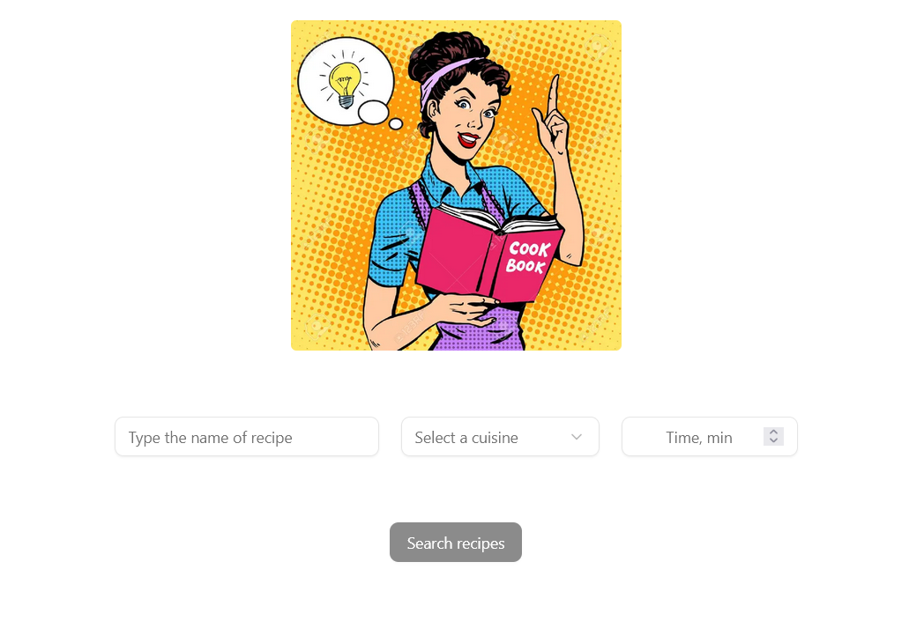
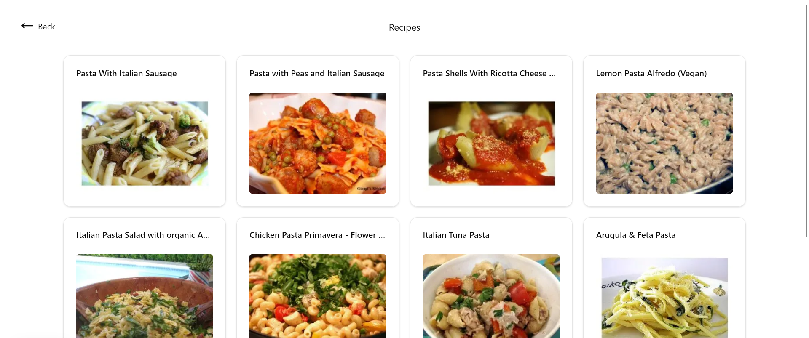
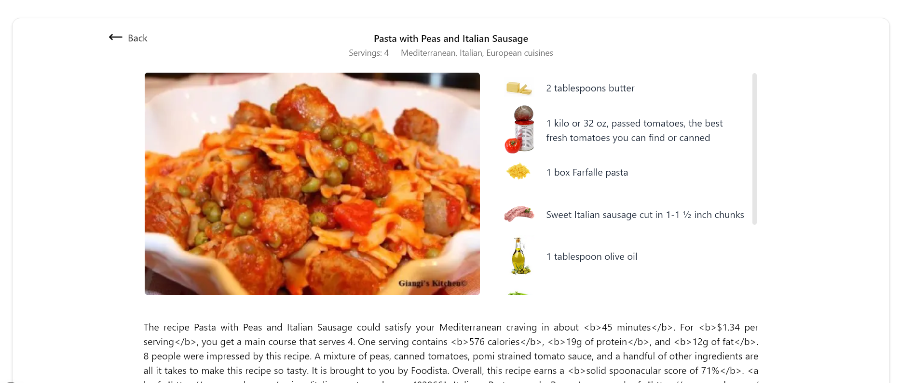

## Getting Started

First, run the development server:

```bash
npm run dev
# or
yarn dev
# or
pnpm dev
# or
bun dev
```

Open [http://localhost:3000](http://localhost:3000) with your browser to see the result.

You can start editing the page by modifying `app/page.tsx`. The page auto-updates as you edit the file.

## Build

To build the application for production:

```bash
npm run build
```

## Application Overview

This application is a recipe discovery platform that allows users to search for recipes based on various filters
such as query keywords, cuisine type, and maximum preparation time. It fetches data from an external API and displays detailed recipe information including ingredients, images, servings, and summaries.

- I was using Next.js framework with the app directory for routing and React Server Components to handle data fetching efficiently.

- I was building a component-based UI with modular and reusable React components, styled using Tailwind CSS for rapid and consistent design.

- I was integrating with an external recipe API, implementing caching and revalidation to keep the data fresh and performant.

- I was combining server-side data fetching with client-side interactivity by using React Suspense and dynamic imports to optimize loading and user experience.

- I was implementing graceful error handling with fallback UI components to ensure a smooth experience even when issues occur.

## Project Structure

    - app/page.tsx — Home page with recipe search form (query, cuisine, max ready time)

    - app/recipes/recipes-list.tsx — Component to display list of recipes fetched from the API

    - app/recipes/[id]/detailed-recipe.tsx — Component to display detailed info of recipe fetched from the API by id

    - app/recipes/page.tsx — Recipes list page that contains RecipesList component

    - app/recipes/[id]/page.tsx — Recipe details page by recipe ID

    - components/ui/* — Reusable UI components (cards, buttons, scroll area, select, skeletons)

    - lib/utils.ts — Utility functions (cn function)

## Screenshots

- Home Page:

  

- Recipes Page:

  

- Detailed Recipe Page:

  
